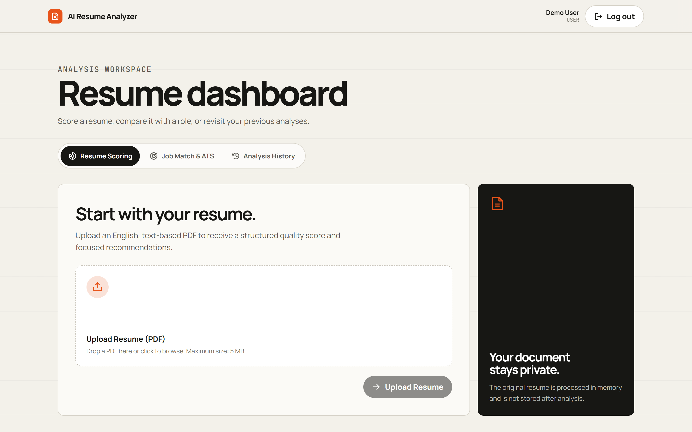
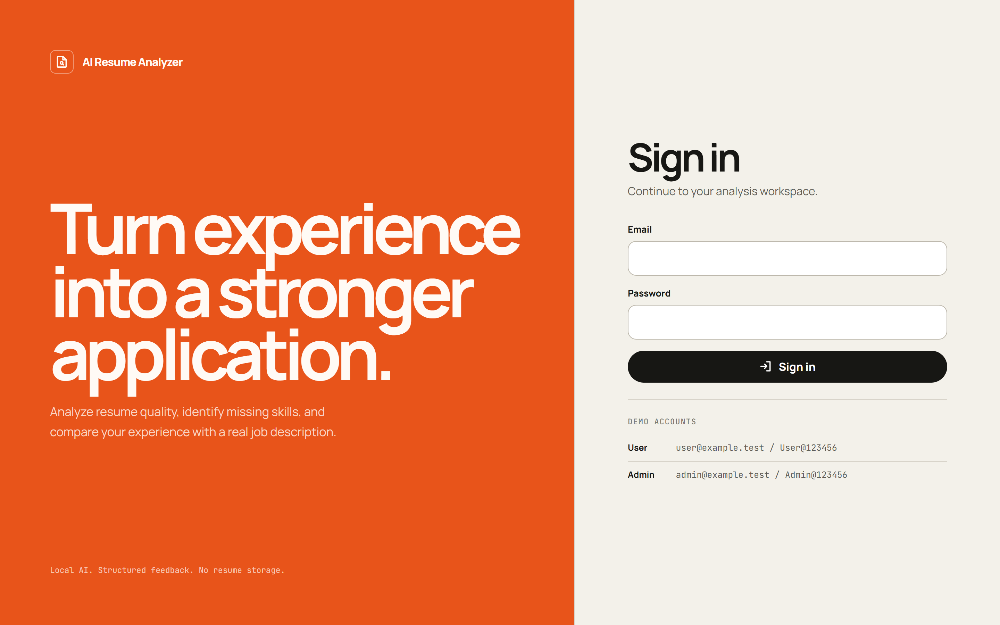
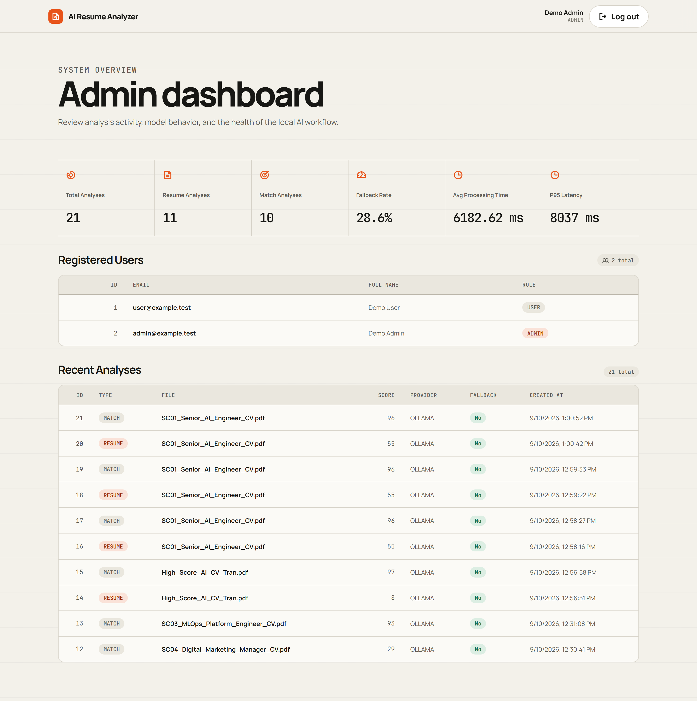
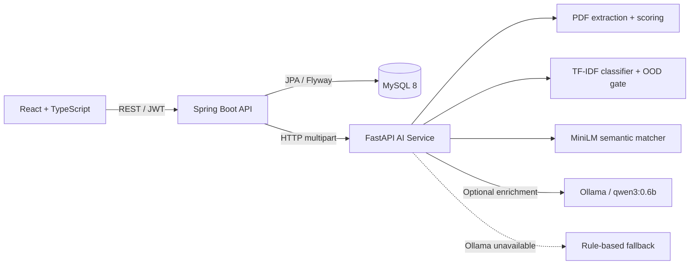

# AI Resume Analyzer

Documentation: [guides](docs/README.md) · [evaluation guide](evaluation/README.md) · [presentation guide](docs/PROJECT_PRESENTATION.md) · [team assignments](docs/TEAM_ASSIGNMENTS.md).

Qwen3 0.6B is the default runtime model. See [Ollama setup and diagnostics](docs/project/OLLAMA_LOCAL_DEMO.md) for startup commands. Published human-review scores describe the historical Qwen 4B run, not the current 0.6B model.

AI Resume Analyzer là ứng dụng web chạy local giúp đánh giá CV tiếng Anh, phân loại lĩnh vực bằng mô hình học máy, so khớp CV–JD bằng sentence embedding và đưa ra gợi ý có cấu trúc. Ollama chỉ làm giàu nội dung diễn giải; pipeline chấm điểm và kết quả cốt lõi vẫn hoạt động khi Ollama không sẵn sàng.

> Trạng thái: MVP đã triển khai đủ 5 luồng chính — đăng nhập, phân tích CV, JD matching, lịch sử người dùng và admin dashboard.

## Giao diện

### User Dashboard



<details>
<summary>Xem thêm màn hình Login và Admin Dashboard</summary>

### Login



### Admin Dashboard



> Admin Dashboard trong ảnh sử dụng dữ liệu demo để minh họa đầy đủ trạng thái KPI và bảng dữ liệu.

</details>

## Tính năng chính

- Đăng nhập bằng email/password, JWT access token và phân quyền `USER` / `ADMIN`.
- Upload CV tiếng Anh ở định dạng PDF, tối đa 5 MB.
- Trích xuất tên, email, kỹ năng và nhóm chuyên môn từ CV.
- Chấm điểm CV theo 8 nhóm tiêu chí với tổng điểm 0–100.
- So khớp CV với JD bằng skill coverage và `all-MiniLM-L6-v2`, trả về breakdown, matched skills, missing skills và ATS keywords.
- Đề xuất kỹ năng và hành động cải thiện CV.
- Lưu kết quả có cấu trúc để người dùng xem lại lịch sử; không lưu file CV hoặc nội dung JD gốc.
- Admin dashboard hiển thị users, analyses, fallback rate và latency của AI pipeline.
- Tự động chuyển sang rule-based fallback khi Ollama lỗi, timeout hoặc chưa được cài đặt.
- OpenAPI contracts, fixtures, evaluation dataset và CI được lưu cùng mã nguồn.

## Kiến trúc



Spring Boot là ranh giới bảo mật và điều phối chính. Frontend không gọi trực tiếp AI service; mọi thao tác USER được giới hạn theo tài khoản đã xác thực và các endpoint quản trị yêu cầu role ADMIN.

## Công nghệ sử dụng

| Thành phần | Công nghệ |
| --- | --- |
| Frontend | React 18, TypeScript, Vite 7, CSS Modules, Phosphor Icons |
| Backend | Java 21, Spring Boot 3.3, Spring Security, JPA, Flyway |
| AI service | Python 3.11, FastAPI, Pydantic, pypdf, scikit-learn, sentence-transformers |
| Database | MySQL 8; H2 dùng cho test và chạy backend độc lập |
| Local AI | Ollama với model mặc định `qwen3:0.6b` |
| Testing | Jest, Testing Library, JUnit, pytest |
| Runtime & CI | Docker Compose, GitHub Actions |

## Luồng nghiệp vụ

1. **Login:** xác thực tài khoản demo và cấp JWT có thời hạn mặc định 2 giờ.
2. **Resume Analysis:** upload PDF, trích xuất dữ liệu, tính score breakdown và nhận recommendations.
3. **Job Match & ATS:** so sánh CV với JD PDF/text để tìm kỹ năng phù hợp, khoảng trống và ATS keywords.
4. **Analysis History:** USER xem danh sách và chi tiết các kết quả của chính mình.
5. **Admin Dashboard:** ADMIN theo dõi người dùng, analyses, provider, fallback và latency.

## Cấu trúc repository

```text
.
├── frontend/                   # React application, pages, UI primitives và tests
├── backend/                    # Spring Boot API, security, persistence và migrations
├── ai-service/
│   ├── app/                    # parsing, extraction, scoring, matching, ML và LLM
│   ├── models/                 # classifier artifact và matching metadata
│   ├── training/               # classifier training
│   └── tests/
├── contracts/
│   ├── openapi/                # Public API và AI service specifications
│   └── fixtures/               # Request, response và error fixtures
├── evaluation/
│   ├── datasets/               # classification, matching, LLM và legacy fixtures
│   ├── scripts/                # build, validate và evaluate
│   └── reports/
├── sample_files/               # resumes, job_descriptions và manual PDFs
├── docs/                       # operating guides and images
├── scripts/                    # OpenAPI export và repository utilities
├── .github/workflows/ci.yml    # CI cho frontend, backend và AI service
├── docker-compose.yml
└── .env.example
```

## Chạy nhanh bằng Docker Compose

### Yêu cầu

- Docker Engine/Desktop có Docker Compose.
- Đủ dung lượng/RAM để build PyTorch và model embedding trong AI image.
- Ollama là tùy chọn; không có Ollama thì hệ thống dùng deterministic fallback.

### 1. Chuẩn bị cấu hình

```bash
git clone https://github.com/TranQuan231005/AI_RESUME_ANALYZER.git
cd AI_RESUME_ANALYZER
cp .env.example .env
```

Các giá trị trong `.env.example` phù hợp cho demo local. Hãy thay `JWT_SECRET` và mật khẩu database nếu chạy trong môi trường dùng chung.

### 2. Chuẩn bị Ollama (tùy chọn)

```bash
ollama pull qwen3:0.6b
ollama serve
```

Nếu Ollama đang chạy trên máy host, container AI service kết nối qua `host.docker.internal:11434` theo cấu hình mặc định.

### 3. Khởi động hệ thống

```bash
docker compose up --build
```

Sau khi các service khởi động:

| Service | URL |
| --- | --- |
| Frontend | http://localhost:5173 |
| Backend API | http://localhost:8080 |
| AI service | http://localhost:8000 |
| AI service OpenAPI | http://localhost:8000/docs |
| MySQL | `localhost:3306` |

Dừng stack bằng `Ctrl+C`. Dùng `docker compose down` để dừng và xóa containers; volume MySQL vẫn được giữ lại.

Nếu các cổng mặc định hoặc tên container đang được dùng bởi một stack khác, dùng cấu hình local với project name riêng:

```powershell
docker compose -p ai-resume-online -f docker-compose.yml -f docker-compose.local.yml up --build --detach
```

Stack local dùng frontend `15173`, backend `18080`, AI service `18000` và MySQL `13306`. Dừng đúng stack bằng cùng project name và file Compose; không dùng `down --volumes` nếu cần giữ dữ liệu demo.

## Tài khoản demo

Khi chạy Docker Compose, seed accounts được bật mặc định và được tạo idempotent:

| Role | Email | Password | Route sau đăng nhập |
| --- | --- | --- | --- |
| USER | `user@example.test` | `User@123456` | `/dashboard` |
| ADMIN | `admin@example.test` | `Admin@123456` | `/admin` |

Có thể thay đổi các tài khoản này qua nhóm biến `SEED_USER_*` và `SEED_ADMIN_*` trong `.env`.

## Chạy từng service khi phát triển

### AI service

```bash
cd ai-service
python3.11 -m venv .venv
source .venv/bin/activate
pip install -r requirements.txt
uvicorn app.main:app --reload --port 8000
```

### Backend

Backend mặc định có thể dùng H2 in-memory. Cần khai báo JWT secret và bật seed nếu muốn đăng nhập bằng tài khoản demo:

```bash
cd backend
JWT_SECRET='replace-with-at-least-32-bytes-secret' \
SEED_USERS_ENABLED=true \
SEED_USER_EMAIL='user@example.test' \
SEED_USER_PASSWORD='User@123456' \
SEED_USER_FULL_NAME='Demo User' \
SEED_ADMIN_EMAIL='admin@example.test' \
SEED_ADMIN_PASSWORD='Admin@123456' \
SEED_ADMIN_FULL_NAME='Demo Admin' \
AI_SERVICE_URL='http://localhost:8000' \
./gradlew bootRun
```

### Frontend

```bash
cd frontend
npm ci
npm run dev
```

Vite chạy tại `http://localhost:5173` và proxy các request `/api` sang `VITE_API_BASE_URL`, mặc định là `http://localhost:8080`.

## Biến môi trường quan trọng

| Biến | Giá trị mặc định | Mô tả |
| --- | --- | --- |
| `DB_NAME` | `resume_analyzer` | Tên database MySQL |
| `DB_USER` | `analyzer_user` | Database user |
| `DB_PASSWORD` | `analyzer_pass` | Database password cho local demo |
| `JWT_SECRET` | Có trong `.env.example` | Secret ký JWT, tối thiểu 32 bytes |
| `JWT_EXPIRATION_MS` | `7200000` | Thời hạn access token, milliseconds |
| `AI_SERVICE_URL` | `http://localhost:8000` | URL AI service cho backend |
| `AI_TIMEOUT_SECONDS` | `60` | Timeout khi gọi AI/Ollama |
| `OLLAMA_BASE_URL` | `http://localhost:11434` | Ollama endpoint |
| `OLLAMA_MODEL` | `qwen3:0.6b` | Model enrichment; 4B có thể chọn bằng biến môi trường |
| `CLASSIFIER_ARTIFACT_DIR` | `ai-service/models/classifier` khi local | Classifier pipeline và metadata |
| `MATCHING_CONFIG_PATH` | `ai-service/models/matching/metadata.json` khi local | Trọng số matching đã version hóa |
| `EMBEDDING_MODEL_PATH` | `ai-service/models/all-MiniLM-L6-v2` khi local | Model embedding offline; Docker dùng `/opt/models/all-MiniLM-L6-v2` |
| `VITE_API_BASE_URL` | `http://localhost:8080` | Backend target cho Vite proxy |

Xem toàn bộ cấu hình tại [`.env.example`](.env.example).

## API chính

| Method | Endpoint | Quyền | Chức năng |
| --- | --- | --- | --- |
| `POST` | `/api/auth/login` | Public | Đăng nhập và nhận JWT |
| `GET` | `/api/me` | Authenticated | Lấy thông tin người dùng hiện tại |
| `POST` | `/api/analyses/resume` | USER | Phân tích một CV PDF |
| `POST` | `/api/analyses/match` | USER | So khớp CV với JD PDF/text |
| `GET` | `/api/analyses` | USER | Lấy lịch sử có phân trang |
| `GET` | `/api/analyses/{id}` | USER | Lấy chi tiết analysis thuộc người dùng |
| `GET` | `/api/admin/users` | ADMIN | Danh sách users có phân trang |
| `GET` | `/api/admin/analyses` | ADMIN | Danh sách analyses và bộ lọc |
| `GET` | `/api/admin/metrics` | ADMIN | Tổng hợp AI metrics |

Nguồn chuẩn cho request/response schema:

- [`contracts/openapi/public-api.json`](contracts/openapi/public-api.json)
- [`contracts/openapi/ai-service.json`](contracts/openapi/ai-service.json)
- [`contracts/fixtures/`](contracts/fixtures/)

## Pipeline AI và explainability

Resume score gồm 8 nhóm tiêu chí. Classifier chọn một trong năm lĩnh vực hoặc `Unknown`, trả confidence, influential terms và taxonomy skills. Ngưỡng `Unknown` được calibration bằng validation in-domain kết hợp OOD.

Matching chia CV/JD thành chunk tối đa khoảng 180 từ, encode normalized embeddings 384 chiều và lấy cosine tốt nhất cho từng JD chunk. Điểm production kết hợp semantic score với skill coverage theo `ai-service/models/matching/metadata.json`; JD không có recognized skill dùng semantic 100%. Nếu embedding không tải được, response ghi rõ `SKILL_ONLY`. TF-IDF chỉ còn là baseline evaluation.

Cấu hình runtime hiện tại dùng `0.7 × skill score + 0.3 × semantic score`. Báo cáo calibration có thể ghi alpha khác vì evaluator tạo cấu hình tạm để benchmark; không gộp hai kết quả thành một metric production nếu chưa đồng bộ lại metadata.

Embedding dùng `sentence-transformers/all-MiniLM-L6-v2` (Apache-2.0), khóa revision `f5610b47471b118dafc55f4c387822dbfc8413ae`. Docker tải revision này ở build time và runtime không tải mạng.

`ai` metadata chỉ mô tả Ollama enrichment. Model matching nằm trong `matchBreakdown`, tránh trộn hai khái niệm.

## Dữ liệu và quyền riêng tư

- Chỉ chấp nhận PDF tiếng Anh dạng có thể trích xuất text, tối đa 5 MB.
- CV và JD được xử lý trong memory; file/nội dung gốc không được persist.
- Database chỉ lưu kết quả JSON có cấu trúc và metadata phục vụ history/admin.
- Mật khẩu được băm bằng BCrypt.
- Backend dùng stateless JWT và kiểm tra role ở API boundary.
- USER chỉ được đọc analysis thuộc tài khoản của mình.

Đây là ứng dụng demo local. Không dùng credentials mẫu hoặc secret trong `.env.example` cho production.

## Kiểm thử

### Frontend

```bash
cd frontend
npm ci
npm run lint
npm test -- --runInBand
npm run build
```

### Backend

```bash
cd backend
./gradlew test --no-daemon
```

### AI service, contracts và evaluation

```bash
python3.11 -m venv .venv
source .venv/bin/activate
pip install -r ai-service/requirements.txt
pytest
python scripts/export_openapi.py --check
python evaluation/scripts/validate_classification_dataset.py
python evaluation/scripts/validate_matching_dataset.py
python evaluation/scripts/evaluate_llm.py --mode schema-only
python evaluation/scripts/evaluate_classifier.py --output /tmp/classification-report.md
python evaluation/scripts/evaluate_matching.py --output /tmp/matching-report.md --allow-pending
```

Đánh giá Qwen thật cần Ollama, output lưu riêng và hai reviewer độc lập:

See the [evaluation guide](evaluation/README.md) for live generation and independent human review. Saved scores apply only to the reviewed model and outputs.

Huấn luyện lại classifier bằng Python 3.11:

```bash
python ai-service/training/train_classifier.py
python evaluation/scripts/evaluate_classifier.py --output evaluation/reports/classification.md
```

Mọi lệnh tạo report phải chỉ định `--output`; CI ghi vào `/tmp` để không làm dirty worktree.

GitHub Actions chạy type-check/test/build frontend, Gradle tests, pytest và kiểm tra OpenAPI trên push hoặc pull request vào `main`, `master` và `develop`.

## Dữ liệu demo

Thư mục [`sample_files/resumes/`](sample_files/resumes/) chứa CV synthetic theo nhóm chuyên môn và các trường hợp biên. [`sample_files/job_descriptions/`](sample_files/job_descriptions/) chứa JD demo; [`sample_files/manual/`](sample_files/manual/) chỉ chứa text-PDF synthetic với địa chỉ `example.test`, dùng cho demo upload và không được dùng cho training/evaluation.

250 CV in-domain và 100 OOD đều là synthetic controlled benchmark, không chứng minh hiệu quả trên CV thực tế. Matching đã có hai reviewer cho đủ 70 cặp và báo cáo đã được công bố; MAE cao và Spearman gần 0 giới hạn khả năng khẳng định chất lượng xếp hạng. Báo cáo LLM hiện có thuộc Qwen3 4B, không áp dụng cho model mặc định 0.6B. LLM schema-only chỉ kiểm tra cấu trúc/validator. Xem [`evaluation/reports/`](evaluation/reports/).

Human review LLM đánh giá các output Qwen3 4B đã lưu. Nếu cần công bố chất lượng Qwen3 0.6B, phải sinh output 0.6B mới và thu review độc lập mới; không chuyển điểm 4B sang 0.6B.

## Giới hạn phạm vi MVP

- Không có registration hoặc refresh token.
- Không có thanh toán, cloud deployment hoặc lưu trữ resume gốc.
- Không hỗ trợ OCR cho PDF scan/image-only.
- Không có dark mode hoặc analytics theo chuỗi thời gian.
- UI, API messages, fixtures và AI output sử dụng tiếng Anh.

## Documentation

- [Ollama setup and diagnostics](docs/project/OLLAMA_LOCAL_DEMO.md).
- [Evaluation and review evidence](evaluation/README.md).
- [API specifications](contracts/openapi/) and [fixtures](contracts/fixtures/).
- [Presentation and defense guide](docs/PROJECT_PRESENTATION.md).
- [Current team assignments](docs/TEAM_ASSIGNMENTS.md).

## License

Repository hiện chưa khai báo license. Mọi quyền được bảo lưu cho đến khi có file `LICENSE` chính thức.
