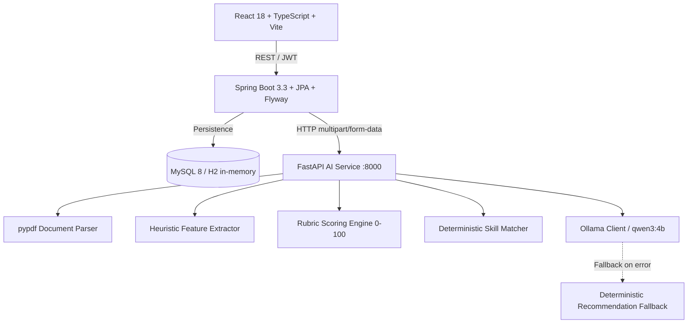
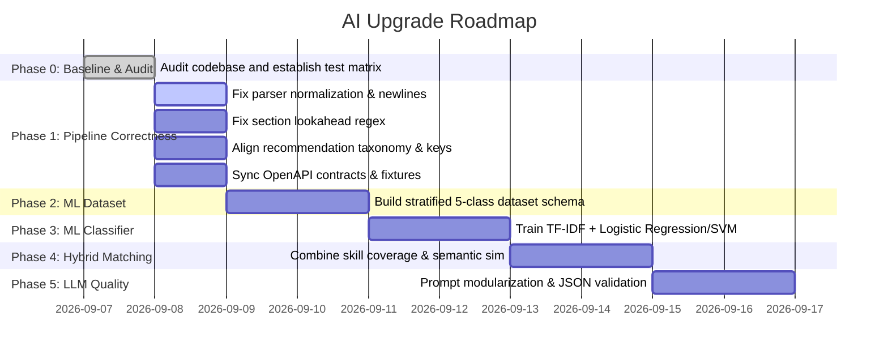

# AI Baseline & Repository Audit (Phase 0)

> **Date:** September 7, 2026  
> **Repository:** `AI_RESUME_ANALYZER`  
> **Status:** Phase 0 Complete — Audit & Baseline Established  

---

## 1. Current Architecture

### Core Flow Integrity:
The repository maintains 5 business flows:
1. **Login & JWT Authentication** (Spring Security + H2/MySQL)
2. **Resume Analysis** (FastAPI PDF parsing -> Feature extraction -> Scoring breakdown -> Recommendations)
3. **CV–JD Matching** (PDF/Text extraction -> Skill coverage calculation -> ATS recommendations)
4. **User History** (Spring Boot persistence of structured JSON results)
5. **Admin AI Dashboard** (Aggregated metrics, fallback rate, latency tracking)

---

## 2. Current AI & ML Components

| Component | Current Implementation | Academic/ML Evaluation |
|---|---|---|
| **Field Classifier** | `ai-service/app/extraction/classifier.py` — Counts keyword occurrences matching predefined skill taxonomy per category. | **Rule-based heuristic**, not a trained Machine Learning model. No statistical learning, no feature vectorization, no loss function. |
| **CV Scoring** | `ai-service/app/scoring/engine.py` — Fixed point allocation across 8 rubric categories (0–100 total). | **Deterministic Expert System**. |
| **CV–JD Matcher** | `ai-service/app/matching/engine.py` — Exact token & alias matching (`round(100 * matched / total_jd)`). | **Deterministic Overlap Heuristic**. No semantic embeddings or vector similarity. |
| **LLM Integration** | `ai-service/app/llm/client.py` & `main.py` — Ollama `qwen3:4b` with hardcoded system prompts in `main.py`. | **Generative AI for advisory enrichment only** (recommended skills, ATS keywords, strengths/weaknesses). Has retry loop and JSON mode parsing. |

---

## 3. Current Rule-Based Components

1. **Text Normalization:** Unicode NFKC normalization + whitespace reduction.
2. **Contact Extraction:** Regex for email (`EMAIL_PATTERN`) and first non-heading line for candidate name.
3. **Skill Taxonomy:** 17 canonical skills across 6 domains with predefined alias maps.
4. **Scoring Breakdown:** 8 categories: Contact (5), Summary (10), Skills (15), Education (10), Experience (20), Projects (15), Achievements/Certifications (10), Quantified Impact (15).
5. **Matching Engine:** Exact set intersection over normalized taxonomy tokens.

---

## 4. Discovered Bugs, Vulnerabilities & Inconsistencies

### Critical Issues (P0)

1. **PDF Text Normalization Collapses All Newlines (`parser.py`):**
   - **Location:** `ai-service/app/document/parser.py:15` (`re.sub(r'\s+', ' ', text)`) and line 32 (`" ".join(extracted_text_parts)`).
   - **Impact:** Entire PDF content is flattened into a single giant line. All line breaks and section boundaries are completely lost.
   - **Consequence:** `extract_candidate_name()` splits text on `\n` and immediately fails because the entire document is treated as one line.

2. **Section Parser "Swallow" Bug in Scoring Engine (`scoring/engine.py`):**
   - **Location:** `ai-service/app/scoring/engine.py:18-20` (`pattern = r"(?i)(?:^|\n)\s*(?:" + "|".join(headers) + r")\b[:\s]*\n?(.*?)(?=\n\s*[A-Z][A-Za-z\s]{2,20}:|\Z)"`).
   - **Impact:** The lookahead `(?=\n\s*[A-Z][A-Za-z\s]{2,20}:|\Z)` requires next headings to end with a colon `:`. If subsequent sections like `EDUCATION` or `PROJECTS` do not contain a colon, the preceding section (`EXPERIENCE`) swallows the remainder of the document up to `\Z`.

3. **Domain Taxonomy Mismatch (`recommendation/engine.py` vs `taxonomy.py`):**
   - **Location:** `taxonomy.py` defines 6 fields: `["Data Science", "Web Development", "Android Development", "iOS Development", "UI/UX", "Unknown"]`.
   - **Conflict:** `recommendation/engine.py` defines `TAXONOMY_BY_FIELD` with `["Software Engineering", "Data Science", "Unknown"]`.
   - **Impact:** Any resume classified as "Web Development", "Android Development", "iOS Development", or "UI/UX" falls back to generic "Unknown" soft skills recommendations.

4. **Internal Snake_Case vs CamelCase Mismatch in Recommendation Engine:**
   - **Location:** `recommendation/engine.py:33-35` looks for `score_breakdown.get("achievementsCertifications", 0)` and `score_breakdown.get("quantifiedImpact", 0)`.
   - **Impact:** When `score_breakdown.model_dump(by_alias=False)` is passed (using Python snake_case keys `achievements_certifications` and `quantified_impact`), `.get()` returns `0`, causing unwarranted low-score warnings to always trigger.

5. **Irrelevant Recommendation for Missing Phone Number:**
   - **Location:** `recommendation/engine.py:22` advises: `"Ensure your full name, professional email, and phone number are clearly visible at the top."`
   - **Conflict:** The parser and scoring engine do NOT extract or score phone numbers (only name and email are scored).

6. **OpenAPI Contract Drift:**
   - **Location:** `contracts/openapi/ai-service.json` differs from current FastAPI schemas (`jobDescription` length description and `jdFileName` description). `py scripts/export_openapi.py --check` exits with code 1.

7. **Ground Truth Circularity in Evaluation:**
   - **Location:** `evaluation/matching-ground-truth.json`.
   - **Issue:** Ground truth scores are explicitly computed using the exact rule formula (`round(100 * count(matchedSkills) / count(jdSkills))`). This violates academic rigor by validating an algorithm with its own definition.

8. **Frontend Build / Test Failure:**
   - **Location:** `frontend/` Jest tests (8 suites fail) and `tsc --noEmit` fail due to missing `@phosphor-icons/react` package resolution in `node_modules`.

---

## 5. Baseline Test Matrix

| Test Suite | Command | Result | Notes |
|---|---|---|---|
| **AI Service Unit Tests** | `py -3.9 -m pytest ai-service/tests` | **78 / 78 PASSED** | 2 FastAPI lifespan deprecation warnings. |
| **Repository Root Pytest** | `py -3.9 -m pytest` | **78 / 78 PASSED** | Discovers and runs AI service tests cleanly. |
| **OpenAPI Contract Check** | `py -3.9 scripts/export_openapi.py --check` | **FAILED** | Schema drift in `contracts/openapi/ai-service.json`. |
| **Dataset Validation** | `py -3.9 evaluation/validate_dataset.py` | **PASSED** | 10 synthetic JDs, 12 test pairs. |
| **Rule-Only Matching Benchmark** | `py -3.9 evaluation/run_evaluation.py --mode rule-only` | **PASSED** | 12/12 evaluated pairs matched 100% (due to circular formula). |
| **Backend Unit & Integration Tests** | `.\gradlew test --no-daemon` (with JDK 21) | **BUILD SUCCESSFUL** | All JPA, Spring Security, and Controller tests pass. |
| **Frontend Unit Tests** | `npm.cmd test -- --runInBand` | **8 FAILED / 2 PASSED** | Module `@phosphor-icons/react` unresolved in Jest. |
| **Frontend TypeScript Build** | `npm.cmd run build` | **FAILED** | `tsc` cannot find `@phosphor-icons/react` declarations. |

---

## 6. Evaluation Dataset State & Limitations

- **Dataset Size:**
  - Resume Extraction: Only **1 sample** (`evaluation/extraction-ground-truth-format.json`).
  - Job Descriptions: **10 synthetic descriptions** (`evaluation/job-descriptions.json`).
  - Matching Pairs: **12 synthetic pairs** (`evaluation/matching-ground-truth.json`).
  - Classification Training Data: **0 samples** (no ML dataset exists yet).
- **Provenance & Licensing:** All existing evaluation samples are hand-authored synthetic snippets.
- **Independence:** Ground truth labels for matching are derived from the rule formula itself rather than human expert evaluation.

---

## 7. Proposed Priority Roadmap (P0 / P1 / P2)

### P0 — Mandatory Correctness & Core Academic Baseline:
1. **Fix PDF Parser Normalization:** Preserve line breaks (`\n`) and page boundaries (`\n\n`), normalize horizontal whitespace only, apply NFKC.
2. **Fix Candidate Name Extraction:** Add robust heuristics handling titles, headings, punctuation (hyphens, apostrophes) without newline dependency failures.
3. **Fix Section Splitting in Scoring Engine:** Update header lookaheads to recognize headers with or without colons and prevent section swallowing.
4. **Align Recommendation Taxonomy:** Align all 6 fields across taxonomy and recommendation modules; fix snake_case vs camelCase dictionary access.
5. **Sync OpenAPI Contracts:** Update schema files and run `export_openapi.py --check` cleanly.
6. **Build Classification Dataset (Phase 2):** Construct stratified dataset (50–100 samples per class across Data Science, Web Dev, Android, iOS, UI/UX).
7. **Train & Evaluate ML Classifier (Phase 3):** Train TF-IDF + Logistic Regression / Linear SVM, compare against keyword count baseline, report Accuracy, Macro F1, and Confusion Matrix.

### P1 — Explainability & Hybrid Improvements:
8. **Explainable Output:** Return top influential terms, model confidence, and class probabilities.
9. **Human-Annotated CV–JD Ground Truth:** Replace synthetic formula-derived ground truth with human-labeled match scores.
10. **Semantic Similarity Integration:** Combine lexical skill match with sentence embedding / TF-IDF cosine similarity.
11. **LLM Prompt Modularization & Safety:** Isolate prompts into `app/llm/prompts.py` with versioning, input boundary sanitization, and structured schema validation.

### P2 — Performance & Polish:
12. **Frontend Visualizations:** Model confidence bar, ATS keyword chips, and radar chart for 8 scoring dimensions.
13. **Inference Latency Optimization:** Local embedding caching and pre-warmed sessions.

---

## 8. Conclusion & Sign-off

Phase 0 is complete. No functional code modifications were made. The repository baseline is fully mapped and ready for Phase 1 execution upon user approval.
