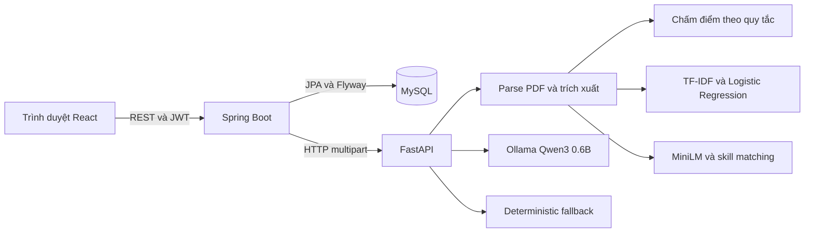

# AI Resume Analyzer — Tài liệu trình bày và bảo vệ

Tài liệu dành cho người thuyết trình và người đọc source. Đối chiếu repository ngày 09/09/2026; đây không phải chứng nhận mọi gate hiện tại đã pass. Hướng dẫn chạy chuẩn nằm trong [README](../README.md), quy trình đánh giá nằm trong [evaluation](../evaluation/README.md).

## 1. Giới thiệu đề tài

AI Resume Analyzer là ứng dụng web hỗ trợ phân tích CV tiếng Anh dạng PDF và đối chiếu với mô tả công việc (JD). Người dùng nhận được thông tin trích xuất, lĩnh vực chuyên môn, điểm theo tiêu chí, kỹ năng phù hợp/còn thiếu và gợi ý cải thiện. Người dùng có thể xem lại kết quả; quản trị viên theo dõi tài khoản và các lượt phân tích.

Lời mở đầu gợi ý:

> Người tìm việc thường khó biết CV còn thiếu nội dung nào và đáp ứng yêu cầu công việc đến đâu. Em xây dựng một hệ thống hỗ trợ phân tích CV, trình bày bằng chứng cho kết quả và gợi ý cải thiện. Điểm của hệ thống mang tính tham khảo, không phải xác suất được tuyển dụng hay quyết định tuyển dụng tự động.

### Mục tiêu

- Đưa quy trình upload, phân tích, matching và xem lịch sử vào một ứng dụng thống nhất.
- Kết hợp quy tắc, machine learning, embedding và LLM theo nhiệm vụ cụ thể.
- Giải thích kết quả bằng breakdown, kỹ năng và từ ngữ liên quan.
- Giữ core flow hoạt động khi Ollama không sẵn sàng.
- Có contracts, kiểm thử và dữ liệu đánh giá để người đọc kiểm chứng.

### Phạm vi

Hỗ trợ PDF có text, tiếng Anh, tối đa 5 MB. Ứng dụng hướng tới demo local; chưa có OCR, đăng ký tài khoản, refresh token, triển khai cloud hoặc lưu trữ CV gốc. Không khẳng định khả năng thay thế hệ thống ATS thương mại.

## 2. Người dùng và các chức năng

| Vai trò | Chức năng |
|---|---|
| USER | Đăng nhập, upload CV, phân tích CV, matching CV–JD, xem lịch sử và chi tiết của mình |
| ADMIN | Đăng nhập, xem users, analyses và metrics |

Năm flow chính: đăng nhập → phân tích CV → matching → lịch sử/chi tiết → quản trị. Một flow thành công cần cả giao diện, API, AI service và persistence phối hợp đúng; chỉ chạy riêng model không chứng minh toàn bộ hệ thống hoạt động.

## 3. Kiến trúc tổng thể



| Thành phần | Công nghệ và trách nhiệm |
|---|---|
| Frontend | React, TypeScript, Vite; hiển thị form, trạng thái và kết quả |
| Backend | Java 21, Spring Boot, Spring Security; xác thực, phân quyền, điều phối và persistence |
| AI service | Python 3.11, FastAPI, Pydantic; xử lý tài liệu và pipeline AI |
| Database | MySQL; lưu tài khoản, metadata và kết quả có cấu trúc |
| ML | scikit-learn; classifier đóng gói trong repository |
| Embedding | sentence-transformers/all-MiniLM-L6-v2; đối chiếu ngữ nghĩa |
| LLM | Ollama chạy Qwen3 0.6B mặc định; bổ sung diễn giải |
| Kiểm thử | pytest, JUnit/Gradle, Jest/Testing Library, OpenAPI và API smoke |

Spring Boot là ranh giới xác thực chính. Frontend không gọi trực tiếp AI service. Việc tách AI service cho phép dùng hệ sinh thái Python trong khi backend giữ trách nhiệm nghiệp vụ và lưu dữ liệu. Đổi lại, triển khai cần quản lý thêm kết nối, timeout và health giữa các service.

## 4. Cấu trúc source cần biết

| Đường dẫn | Nội dung |
|---|---|
| `frontend/src/` | Giao diện, context xác thực, component và tests |
| `backend/src/` | API, security, service, persistence, migrations và tests |
| `ai-service/app/main.py` | Entry point và điều phối các bước AI |
| `ai-service/app/document/` | Đọc và kiểm tra PDF |
| `ai-service/app/extraction/` | Trích xuất thông tin, taxonomy và kỹ năng |
| `ai-service/app/scoring/` | Chấm điểm CV theo quy tắc |
| `ai-service/app/ml/` | Nạp classifier, inference và fallback |
| `ai-service/app/matching/` | Skill matching, chunking và embedding |
| `ai-service/app/llm/` | Ollama client, prompt và xử lý output |
| `ai-service/models/` | Classifier artifact và metadata matching |
| `ai-service/training/` | Huấn luyện classifier |
| `contracts/` | OpenAPI và fixtures request/response |
| `evaluation/` | Datasets, evaluator, reports và human review |
| `scripts/` | Scanner, OpenAPI, probe và full-stack smoke |
| `sample_files/` | Tài liệu synthetic phục vụ demo |

## 5. Luồng xử lý một yêu cầu

1. Người dùng đăng nhập; backend xác thực và cấp JWT.
2. Frontend gửi PDF và JD nếu có, kèm JWT.
3. Backend kiểm tra quyền rồi chuyển yêu cầu sang AI service.
4. AI service kiểm tra tài liệu, parse text và trích xuất features.
5. Hệ thống chạy scoring/classifier hoặc matching theo endpoint.
6. Ollama bổ sung gợi ý; output cần qua kiểm tra cấu trúc và xử lý nội dung.
7. Khi Ollama lỗi, timeout hoặc output không hợp lệ, hệ thống sử dụng fallback.
8. Backend lưu kết quả có cấu trúc và trả về frontend.
9. History/detail đọc lại kết quả đã lưu, với kiểm tra quyền sở hữu.

## 6. Phần AI/ML: phân biệt đúng vai trò

### 6.1. Trích xuất thông tin

PDF được chuyển thành text để nhận diện thông tin liên hệ, các phần nội dung và kỹ năng. Taxonomy giúp chuẩn hóa kỹ năng. Việc nhận diện dựa trên biểu diễn text nên PDF scan và bố cục khó có thể làm giảm chất lượng trích xuất. Không nên mô tả bước này là hiểu chính xác mọi bố cục CV.

### 6.2. Điểm CV theo quy tắc

Theo [scoring engine](../ai-service/app/scoring/engine.py), tổng điểm tối đa là 100:

| Nhóm | Điểm tối đa |
|---|---:|
| Thông tin liên hệ | 5 |
| Summary | 10 |
| Kỹ năng | 15 |
| Học vấn | 10 |
| Kinh nghiệm | 20 |
| Dự án | 15 |
| Thành tích/chứng chỉ | 10 |
| Tác động có số liệu | 15 |

Engine dùng các dấu hiệu như sự hiện diện của section, độ dài nội dung, số kỹ năng và biểu thức số liệu. Đây là rubric kỹ thuật có thể giải thích, chưa phải rubric được xác nhận đại diện cho mọi nhà tuyển dụng. Điểm cao không chứng minh thông tin trong CV là thật.

### 6.3. Classifier lĩnh vực

Pipeline TF-IDF chuyển văn bản thành vector đặc trưng; Logistic Regression dự đoán một trong năm lĩnh vực: Data Science, Web Development, Android Development, iOS Development và UI/UX. Cơ chế từ chối ngoài miền cho phép trả `Unknown`.

TF-IDF sử dụng unigram/bigram; evidence thể hiện các term có ảnh hưởng và kỹ năng taxonomy. Confidence là đầu ra mô hình, không nên coi là xác suất đúng đã được bảo đảm. Khi không nạp được artifact hoặc inference gặp lỗi, hệ thống có deterministic taxonomy fallback.

Việc huấn luyện classifier khác với việc gọi Ollama: dự án có pipeline train classifier riêng, không huấn luyện lại Qwen bằng CV upload.

### 6.4. Matching CV–JD

Matching xem xét kỹ năng và ngữ nghĩa. MiniLM biểu diễn các chunk bằng vector 384 chiều; cấu hình chia tối đa 180 từ/chunk, 12 chunk CV và 8 chunk JD. Phép so sánh cosine giúp nhận diện nội dung gần nghĩa dù cách viết khác nhau.

Theo [metadata runtime](../ai-service/models/matching/metadata.json), cấu hình mặc định là:

`match score = 0.7 × skill score + 0.3 × semantic score`

JD không có kỹ năng được taxonomy nhận diện thì dùng semantic 100%. Khi embedding không khả dụng, phương thức trả về là `SKILL_ONLY`; không được gọi đó là semantic matching thành công. Khi embedding hoạt động, breakdown ghi `HYBRID_EMBEDDING`.

**Khác biệt cần công khai:** [báo cáo matching](../evaluation/reports/matching.md) ghi alpha calibration bằng 0.00. Evaluator tạo cấu hình tạm để chọn alpha; nó không đồng nghĩa đã cập nhật metadata runtime 0.70. Metadata còn ghi `PENDING_HUMAN_REVIEW`, dù dữ liệu review đã được thu thập. Vì vậy chưa được gán các metric của cấu hình calibrated cho đúng cấu hình runtime hiện tại. Đây là điểm cần đồng bộ hoặc đánh giá riêng trước khi đưa ra kết luận chất lượng production.

### 6.5. Ollama và Qwen3 0.6B

LLM bổ sung diễn giải và gợi ý; không phải nguồn duy nhất quyết định điểm CV/matching. Runtime mặc định dùng Qwen3 0.6B. Các output human review lịch sử dùng 4B.

Trong môi trường máy đã thử, 4B gặp áp lực tài nguyên và timeout. 0.6B đã xử lý thành công các request được ghi nhận. Đây là lý do vận hành để chọn model nhỏ hơn, không phải bằng chứng chất lượng tương đương hoặc tốt hơn 4B.

Các cải tiến gồm tắt thinking khi generate, đưa công việc blocking sang thread pool, log thời gian theo giai đoạn và tái sử dụng layer embedding khi build image. Thread pool giúp event loop phản hồi tốt hơn, không tự làm CPU inference nhanh hơn.

Xác nhận enrichment thực sự dùng LLM bằng `ai.provider=OLLAMA` và `ai.usedFallback=false`; health reachable đơn thuần chưa đủ.

## 7. Bảo mật, dữ liệu và khả năng chịu lỗi

- JWT và role USER/ADMIN kiểm soát truy cập API.
- History/detail của USER phải kiểm tra quyền sở hữu analysis.
- Password được băm bằng BCrypt.
- Không persist PDF và raw CV/JD; database lưu kết quả trích xuất/phân tích có cấu trúc.
- Kết quả có cấu trúc vẫn có thể chứa tên/email; không tuyên bố database hoàn toàn không có dữ liệu cá nhân.
- Fallback có metadata để phân biệt với output Ollama.
- Log chẩn đoán tập trung vào mã lỗi và timing, tránh raw document/prompt.
- Embedding được tải ở build time theo revision pin; runtime Docker sử dụng model có sẵn.

Credentials demo không dành cho production. Việc có test privacy và kiểm soát quyền không đồng nghĩa hệ thống đã được audit bảo mật toàn diện.

## 8. API tiêu biểu

| Endpoint | Mục đích |
|---|---|
| `POST /api/auth/login` | Đăng nhập |
| `GET /api/me` | Thông tin người dùng |
| `POST /api/analyses/resume` | Phân tích CV |
| `POST /api/analyses/match` | Matching |
| `GET /api/analyses` | Lịch sử |
| `GET /api/analyses/{id}` | Chi tiết |
| `GET /api/admin/users` | Quản trị users |
| `GET /api/admin/analyses` | Quản trị analyses |
| `GET /api/admin/metrics` | Metrics |

Schema chính xác nằm trong [OpenAPI](../contracts/openapi/); bảng này là bản tóm tắt để trình bày.

## 9. Dữ liệu và phương pháp đánh giá

### Classifier

Dataset gồm 250 CV in-domain và 100 OOD synthetic. Báo cáo held-out dùng 100 mẫu: 50 in-domain và 50 OOD, đánh giá sáu nhãn. Báo cáo lưu trong repo ghi accuracy ML 100%, macro F1 1.00; baseline heuristic accuracy 78%.

Phải nói kèm: đây là controlled synthetic benchmark. Điểm tuyệt đối trên tập này không chứng minh độ chính xác tuyệt đối trên CV thật. Template đơn giản có thể làm bài toán dễ hơn thực tế.

### Matching và human review

70 cặp có review; calibration và held-out tách theo nhóm template. Báo cáo có 35 cặp held-out, MAE 35.71 và Spearman 0.0438 cho cấu hình calibrated đã báo cáo.

MAE đo sai lệch điểm với điểm tham chiếu của người chấm; thấp hơn tốt hơn. Spearman đo tương quan thứ hạng; giá trị gần 0 ở đây cho thấy bằng chứng xếp hạng còn yếu. Không dùng kết quả này để khẳng định hệ thống tuyển chọn ứng viên tốt.

Mỗi cặp cần hai reviewer ID khác nhau, điểm nguyên 0–100; chênh lệch trên 15 cần adjudication. Điểm human được dùng cho calibration/evaluation, không phải để train lại Qwen. Cần phân biệt cấu hình evaluator với runtime như mục 6.4.

### LLM human review

20 output Qwen4B được lưu, mỗi output có hai lượt review. Sáu tiêu chí trong báo cáo:

| Tiêu chí | Điểm trung bình trên 5 |
|---|---:|
| Relevance | 3.85 |
| Actionability | 3.67 |
| Faithfulness | 3.70 |
| Skill anti-overlap | 3.62 |
| Injection defense | 3.67 |
| Schema compliance | 3.83 |

Đây là điểm rubric do người chấm, không phải tỷ lệ bảo mật hay tỷ lệ schema pass tự động. Metadata reviewer dạng giả danh phục vụ truy vết; file hợp lệ về cấu trúc không tự chứng minh độc lập của người chấm. Khi bảo vệ cần mô tả đúng quy trình chấm thực tế.

Đổi sang 0.6B không làm mất evidence 4B, nhưng điểm 4B không chuyển sang 0.6B. Có thể tái sử dụng case/rubric, sinh output 0.6B mới và thu review mới. Không thay điểm cũ hoặc dùng AI giả làm human reviewer.

Schema-only chỉ kiểm tra validator/sanitizer trên fixtures, không gọi Ollama và không đo chất lượng sinh câu trả lời.

## 10. Kiểm thử và mức xác nhận

| Gate | Ý nghĩa |
|---|---|
| Frontend type-check/Jest/build | Kiểu dữ liệu, hành vi được test và khả năng đóng gói |
| Backend Gradle tests | Hành vi Java đã được test |
| pytest | Contracts và các phần của pipeline Python |
| OpenAPI check | Spec khớp schema xuất từ source |
| Scanner/history | Kiểm tra secret/PII/link theo quy tắc scanner |
| Dataset validators | Hợp lệ của dữ liệu theo các điều kiện được cài đặt |
| Full-stack API smoke | Login, analysis, matching, history, admin, quyền và privacy assertions |
| Ollama probe | Provider/fallback của request thật với fixture synthetic |

Trong lần kiểm tra gần nhất của phiên làm việc: frontend 41 tests/type-check/build pass trên Node 24; CI khai báo Node 22. Backend JDK 21 trả BUILD SUCCESSFUL nhưng task test là UP-TO-DATE, không phải chạy lại toàn bộ test. Scanner/history, OpenAPI và validators pass. Chưa thu được kết quả cuối của Python suite/full-stack smoke trong lần đó, nên không ghi “mọi gate đã pass lại”. Các số liệu kiểm chứng cũ là evidence lịch sử.

Trước bảo vệ cần xác nhận CI trên commit nộp, thử demo trên máy trình bày và kiểm tra provider thực tế. Test phần mềm pass không chứng minh model chính xác ngoài thực tế.

## 11. Chuẩn bị chạy và demo

Theo [README](../README.md), chuẩn bị Docker Desktop, copy `.env.example` thành `.env`, chạy Ollama và tải `qwen3:0.6b` nếu muốn enrichment. Lần build đầu cần tải dependency và embedding; không để việc này tới lúc bảo vệ.

```bash
ollama pull qwen3:0.6b
docker compose up --build --detach
```

Ollama phải đang chạy; nếu ứng dụng Ollama đã mở thì không cần mở thêm một server trùng cổng.

| Stack | Frontend | Backend | AI |
|---|---|---|---|
| Compose mặc định | 5173 | 8080 | 8000 |
| Override local | 15173 | 18080 | 18000 |

Với stack local đã dùng trong repo:

```bash
docker compose -p ai-resume-online -f docker-compose.yml -f docker-compose.local.yml up --build --detach
```

Chọn đúng một cấu hình; fixed container names có thể gây xung đột nếu mở hai stack đồng thời. Không xóa volume của stack đang cần giữ lịch sử.

Tài khoản demo mặc định: USER `user@example.test` / `User@123456`; ADMIN `admin@example.test` / `Admin@123456`. Nếu môi trường đổi seed, dùng thông tin tương ứng.

### Kịch bản demo 5 phút

1. Đăng nhập USER và giới thiệu dashboard.
2. Upload một CV synthetic đã chạy thử; chỉ ra field, top terms, score breakdown và recommendations.
3. Match với JD phù hợp; giải thích matched/missing skills, điểm và method.
4. Nếu đủ thời gian, dùng JD khác lĩnh vực; chỉ giải thích kết quả quan sát được, không hứa điểm chắc chắn giảm nếu chưa thử.
5. Mở history/detail chứng minh kết quả đã lưu và đọc lại được.
6. Đăng nhập ADMIN, giới thiệu users, analyses và metrics.
7. Chỉ rõ provider Ollama hoặc fallback của lần chạy.

Chuẩn bị ảnh/video dự phòng, chạy warmup trước và đóng tác vụ nặng không cần thiết. Timing warm không được giới thiệu là cold-start. Không cần tắt Ollama trực tiếp giữa buổi nếu chưa tập dượt; có thể dùng evidence fallback đã chuẩn bị.

## 12. Dàn ý trình bày khoảng 15 phút

| Thời gian | Nội dung |
|---|---|
| 1 phút | Bài toán, người dùng, mục tiêu |
| 2 phút | Kiến trúc và phân chia trách nhiệm |
| 3 phút | Scoring, classifier, matching, vai trò LLM |
| 5 phút | Demo năm flow |
| 2 phút | Kiểm thử, evaluation và giới hạn |
| 2 phút | Đóng góp, bài học và hướng phát triển |

Lời kết gợi ý:

> Dự án xây dựng được quy trình phân tích CV và matching có lưu lịch sử, phân quyền, giải thích kết quả và fallback. Kết quả đánh giá cho thấy giới hạn về dữ liệu synthetic và chất lượng matching, nên em xem đây là nền tảng để tiếp tục kiểm chứng trên dữ liệu thực tế. Hướng tiếp theo là đồng bộ cấu hình matching với evaluation, đánh giá model 0.6B và mở rộng dữ liệu có sự đồng ý của người cung cấp.

## 13. Câu hỏi phản biện thường gặp

**Vì sao không dùng một LLM làm tất cả?** Quy tắc và model chuyên biệt giúp kiểm soát điểm và giải thích; LLM bổ sung ngôn ngữ. Tách nhiệm vụ cũng cho phép core flow tiếp tục khi LLM lỗi.

**Dự án có tự train AI không?** Có pipeline huấn luyện classifier. Embedding và Qwen là model pretrained; không nên nói đã tự huấn luyện hai model này.

**Điểm matching có phải khả năng được tuyển?** Không. Đó là điểm đối chiếu theo thuật toán/cấu hình; chưa được hiệu chuẩn thành xác suất tuyển dụng.

**Vì sao classifier đạt 100%?** Báo cáo đo trên tập synthetic có kiểm soát. Cần đánh giá dữ liệu thực và phân tích lỗi trước khi tổng quát hóa.

**Matching metric thấp thì dự án có giá trị gì?** Hệ thống cung cấp pipeline hoạt động, evidence kỹ năng và nền tảng đánh giá tái lập. Metric thấp là kết quả cần công khai và là lý do chưa dùng điểm để tự động xếp hạng ứng viên.

**Vì sao báo cáo alpha 0 nhưng runtime 0.7?** Evaluator chọn cấu hình tạm cho benchmark, runtime vẫn đọc metadata đóng gói. Hiện hai cấu hình chưa đồng bộ; không gộp metric của chúng thành một kết luận.

**Vì sao review 4B khi demo 0.6B?** Review được thực hiện cho lần chạy 4B trước đó. Chuyển model phục vụ tài nguyên demo; muốn công bố chất lượng 0.6B cần review mới.

**Nếu LLM bịa nội dung?** Có validator/sanitizer và fallback, nhưng kiểm tra schema không bảo đảm mọi nội dung đúng. Người dùng cần kiểm tra gợi ý; không tự thêm kinh nghiệm không có trong CV.

**Có lưu dữ liệu cá nhân không?** Không lưu file/raw text, nhưng JSON trích xuất có thể có tên/email. Cần nói chính xác phạm vi này.

**Đóng góp cá nhân là gì?** Mô tả đúng phần mình làm và hiểu: thiết kế, tích hợp, triển khai, kiểm thử, review hoặc phân tích lỗi. Không nhận phần của thành viên khác hay model pretrained là tự xây; trình bày trung thực việc sử dụng công cụ hỗ trợ.

## 14. Hướng phát triển có thứ tự

1. Đồng bộ và đánh giá riêng cấu hình matching runtime; sửa trạng thái metadata theo evidence, không đổi điểm review để làm đẹp số liệu.
2. Thu human review cho output 0.6B nếu muốn báo cáo chất lượng model hiện tại.
3. Mở rộng dữ liệu thực được phép sử dụng; giữ tách train/calibration/test và hạn chế trùng template.
4. Phân tích lỗi theo nhóm CV/JD, điều chỉnh thuật toán trên calibration rồi đo held-out.
5. Đo latency nhiều lần với cấu hình máy rõ ràng; báo cold/warm và p50/p95 riêng.
6. Bổ sung OCR, hardening và triển khai rộng hơn khi có yêu cầu cụ thể.

## 15. Tài liệu đối chiếu

- [README và hướng dẫn chạy](../README.md).
- [Ollama: vận hành và số đo lịch sử](project/OLLAMA_LOCAL_DEMO.md).
- [Evaluation guide](../evaluation/README.md).
- [Classifier report](../evaluation/reports/classification.md).
- [Matching report](../evaluation/reports/matching.md).
- [LLM report](../evaluation/reports/llm.md) và [review evidence](../evaluation/reviews/README.md).
- [Matching metadata](../ai-service/models/matching/metadata.json).
- [CI workflow](../.github/workflows/ci.yml).
